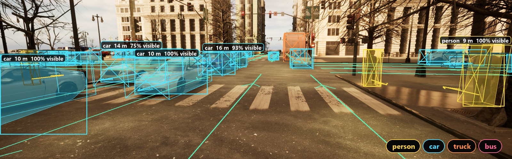

# Evan Petersen

CS @ Cal State San Marcos • Data Science Minor • Expected May 2027

---

## About

I am a Computer Science student at CSU San Marcos with a minor in Data Science, graduating May 2027. I've completed two AI/ML internships: most recently as a Data Scientist Intern at HealthSpanIQ, and before that as an AI Engineer Intern at Nutriverse, building CV and multimodal LLM pipelines and handling the full ML lifecycle from data validation to production inference.

My research focuses on autonomous vehicle perception and synthetic data. As an undergraduate researcher, I'm studying the simulation fidelity required for effective real-world object detection, part of a collaborative effort called the Synthetic Realism Study. I built VantageCV Remastered, a procedural, seed-based synthetic AV perception dataset generator covering the full pipeline from road networks to COCO-format sensor annotations. To build on my experience with simulation and data generation, I plan to learn Isaac Sim to further explore robotics and reinforcement learning.

---

## Current Work

 

### [VantageCV Remastered](https://github.com/evanpetersen919/VantageCV-V2)

Procedural, seed-based synthetic datasets for autonomous-vehicle perception

  

<table>
<tr>
<td width="33%" valign="top" align="center">

**Scenes**

Orthogonal road grids, per-lane topology and turn rules, typed buildings with modular facades, heading-aware vehicles and pedestrians

</td>
<td width="33%" valign="top" align="center">

**Annotations**

Pinhole camera projection with optional lens distortion; 2D/3D bounding boxes, instance segmentation masks, and depth maps exported as schema-validated COCO JSON

</td>
<td width="33%" valign="top" align="center">

**Pipeline**

YAML-driven scenarios and CLI entry points, Ray-backed parallel generation, and checkpointed resumable dataset runs

</td>
</tr>
</table>

---

### Other Projects

- **[VantageCV](https://github.com/evanpetersen919/VantageCV)** - Synthetic CV dataset generator for AV perception research, built in Unreal Engine 5 with a Python control pipeline for generating annotated training data
- **[TripSaver](https://github.com/evanpetersen919/TripSaver)** - Multi-tier scene understanding pipeline with CV + LLM fallback
- **[Turbofan-Health-Prediction](https://github.com/evanpetersen919/Turbofan-Health-Prediction)** - Predictive maintenance for aircraft engines using NASA C-MAPSS dataset
- **[NIH-Chest-Disease-Classifier](https://github.com/evanpetersen919/NIH-Chest-Disease-Classifier)** - Multi-label classification of chest diseases from X-ray images with ResNet50

